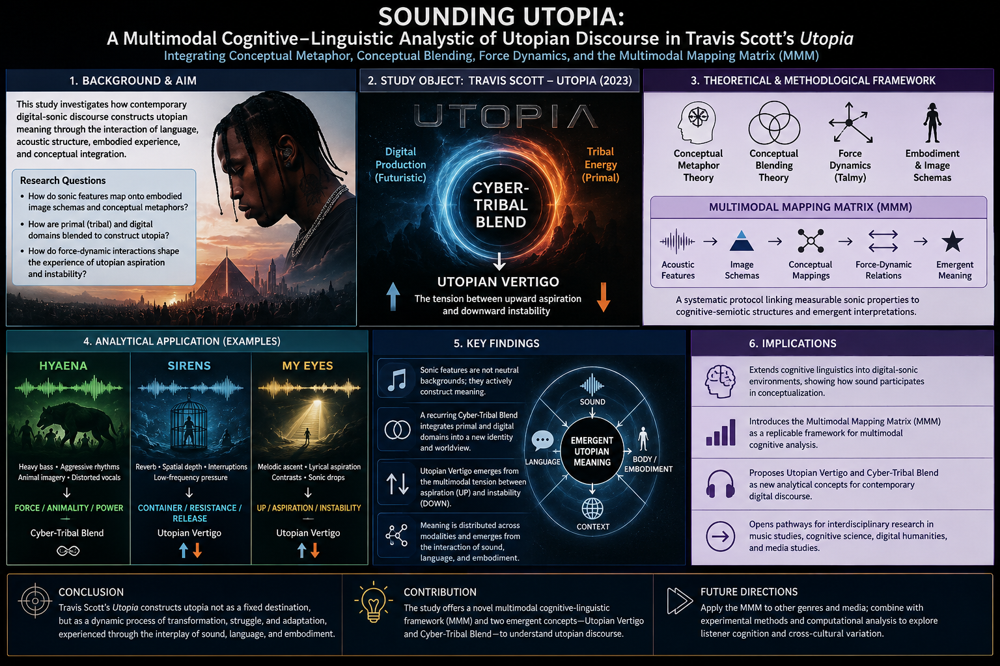
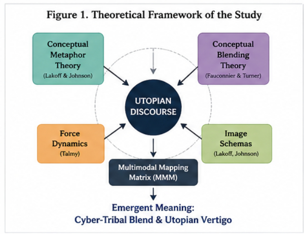
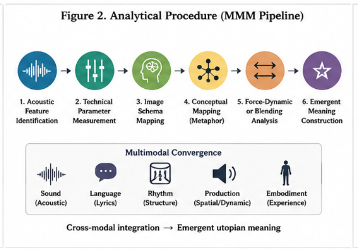
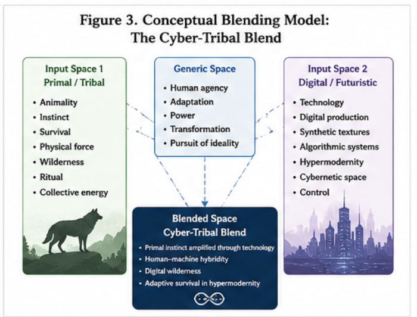
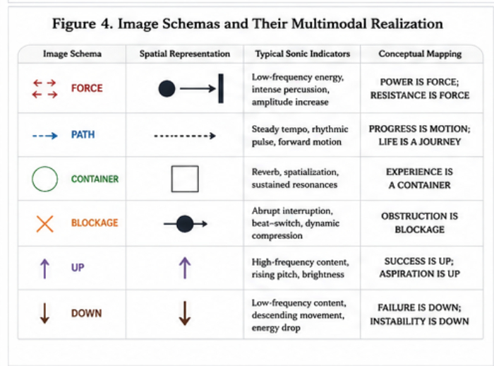
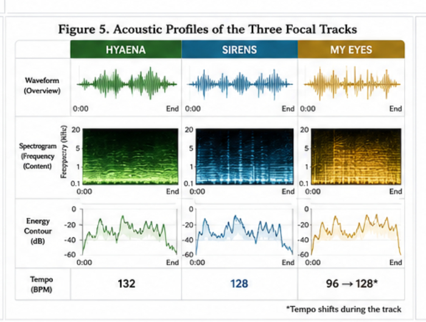
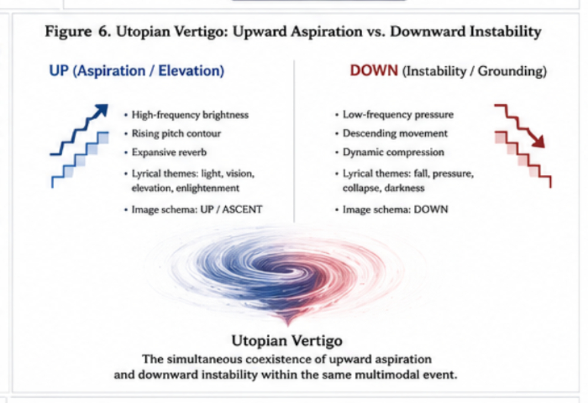
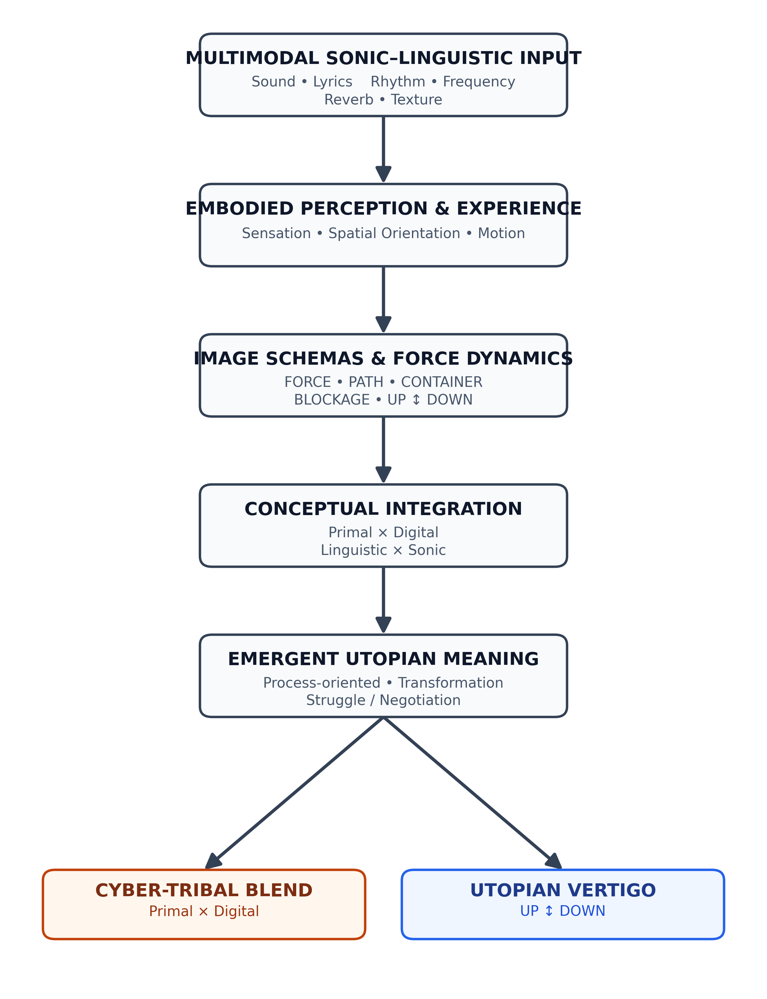

# The Cognitive Linguistics of Utopia

### Multimodal Metaphors and Conceptual Blending in Travis Scott's Sonic World

This repository contains the research materials, analytical framework, multimodal mapping system, visualizations, and supplementary materials associated with the study of *Utopia* (2023) through the lens of Cognitive Linguistics.

The study integrates **Conceptual Metaphor Theory (CMT)**, **Conceptual Blending Theory (CBT)**, **Talmy's Force Dynamics**, and **image-schema analysis** through the proposed **Multimodal Mapping Matrix (MMM)**.

---

## 🎨 Graphic Abstract

The following graphic abstract provides an overview of the study's theoretical framework, methodological procedure, and central findings.

<p align="center">
  
</p>

**Figure GA.** Graphic abstract of the proposed Multimodal Mapping Matrix (MMM), illustrating the mapping from acoustic features and lyrical structures to image schemas, conceptual blends, and the emergent construct of *Utopian Vertigo*.

---

# 📊 Figures

The following figures provide the visual documentation of the analytical framework and empirical findings reported in the article.

## Figure 1. Multimodal Analytical Framework

<p align="center">
  
</p>

**Figure 1.** Multimodal analytical framework integrating acoustic features, lyrical meanings, image schemas, conceptual blending, and force-dynamic relations.

---

## Figure 2. Multimodal Mapping Matrix

<p align="center">
  
</p>

**Figure 2.** Multimodal Mapping Matrix (MMM) linking measurable acoustic properties with cognitive image schemas and emergent interpretive meanings.

---

## Figure 3. Conceptual Blending Architecture

<p align="center">
  
</p>

**Figure 3.** Conceptual Blending architecture showing the interaction between primal/tribal and digital/futuristic input spaces and the resulting emergent conceptual structure.

---

## Figure 4. Force-Dynamic and Sonic Analysis

<p align="center">
  
</p>

**Figure 4.** Force-dynamic analysis illustrating the interaction between sonic forces, cognitive schemas, and the construction of tension within the analyzed tracks.

---

## Figure 4 (continued). Temporal Development of Force-Dynamic Relations

<p align="center">
  
</p>

**Figure 4 (continued).** Temporal continuation of Figure 4, documenting the sequential development of sonic events, force-dynamic interactions, and cognitive responses across the analyzed material.

---

## Figure 5. Acoustic Profiles of the Three Focal Tracks

<p align="center">
  
</p>

**Figure 5.** Acoustic profiles of the three focal tracks—*HYAENA*, *SIRENS*, and *MY EYES*—showing the sonic characteristics used in the multimodal cognitive analysis.

---

## Figure 6. Utopian Vertigo

<p align="center">
  
</p>

**Figure 6.** The proposed *Utopian Vertigo* construct, illustrating the simultaneous activation and interaction of UP/ASCENT and DOWN/INSTABILITY schemas in the construction of contemporary utopian experience.

---

## Figure 7. Integrative Model of Utopian Meaning Construction

<p align="center">
  
</p>

**Figure 7.** Integrative model of multimodal utopian meaning construction, connecting acoustic features, linguistic cues, image schemas, force dynamics, conceptual blending, and emergent meaning.

---

# 🧠 Research Overview

The study investigates how contemporary sonic environments can participate in the construction of abstract concepts such as **utopia, aspiration, instability, transformation, and identity**.

The analytical framework integrates:

- **Conceptual Metaphor Theory (CMT)**
- **Conceptual Blending Theory (CBT)**
- **Force Dynamics**
- **Image Schema Theory**
- **Multimodal Metaphor Analysis**
- **Acoustic and Sonic Analysis**
- **Metaphor Identification Procedure (MIP)**

---

# 🔬 Multimodal Mapping Matrix (MMM)

The **Multimodal Mapping Matrix (MMM)** is the central methodological component of the study.

It provides a systematic analytical bridge between:

**Acoustic Properties → Sonic Events → Image Schemas → Conceptual Mappings → Emergent Meaning**

Examples include:

| Acoustic Feature | Cognitive Mapping | Image Schema | Emergent Meaning |
|---|---|---|---|
| Sub-bass | Physical pressure | FORCE / DOWN | Weight, struggle, instability |
| Rhythmic pulse | Forward movement | PATH | Progression, journey |
| Reverb | Spatial enclosure | CONTAINER | Entrapment, isolation |
| High-frequency textures | Vertical movement | UP / ASCENT | Aspiration, enlightenment |
| Beat-switch | Interruption | FORCE / BLOCKAGE | Conflict, resistance |
| Sonic contrast | Vertical tension | UP ↔ DOWN | Utopian Vertigo |

---

# 🎧 Focal Tracks

Three tracks from Travis Scott's *Utopia* (2023) constitute the primary analytical cases:

### HYAENA
Examined primarily through:

- FORCE
- PATH
- primal/cybernetic blending
- rhythmic propulsion
- sonic aggression

### SIRENS
Examined primarily through:

- CONTAINER
- FORCE DYNAMICS
- spatial enclosure
- interruption
- struggle and release

### MY EYES
Examined primarily through:

- VERTICALITY
- UP / ASCENT
- DOWN
- aspiration
- instability
- Utopian Vertigo

---

# 🧩 Central Theoretical Constructs

## Utopian Vertigo

**Utopian Vertigo** refers to the multimodal cognitive tension produced when upward-oriented schemas of aspiration, transcendence, and enlightenment interact with downward-oriented schemas of instability, collapse, and grounding.

The construct can be represented as:

**UP / ASPIRATION ↕ DOWN / INSTABILITY**

Rather than conceptualizing utopia as a stable destination, the model treats it as a dynamic and unstable process.

---

## Cyber-Tribal Blend

The **Cyber-Tribal Blend** describes the emergent conceptual structure produced through the integration of:

**Primal / Tribal Input Space**

+

**Digital / Cybernetic Input Space**

↓

**Emergent Cyber-Tribal Utopia**

The construct captures the coexistence of evolutionary instincts, technological mediation, digital identity, aggression, adaptation, and aspirations toward an idealized future.

---
## 📊 MMM Acoustic–Schema Dataset

The `mmm_acoustic_schema_mapping.csv` file provides the structured analytical data underlying the Multimodal Mapping Matrix (MMM). It documents the relationship between selected acoustic features, their technical parameters, candidate image schemas, and their interpreted cognitive meanings across the three focal tracks.

| Track | Acoustic Feature | Frequency / Parameter | Candidate Schema | Interpreted Meaning |
|---|---|---|---|---|
| HYAENA | Aggressive 808 | 30–80 Hz | FORCE | Primal Survival |
| HYAENA | Sharp Percussion | 8000 Hz+ | BLOCKAGE | Digital Jungle Obstacles |
| SIRENS | Reverb Vocals | 3.0 s decay | CONTAINER | Spatial Enclosure |
| MY EYES | Rising Synths | 2000–8000 Hz | VERTICALITY (UP) | Ascent / Truth |
| MY EYES | Sub-Bass Rumble | 20–40 Hz | VERTICALITY (DOWN) | Doubt / Fallibility |

> **Analytical note:** The mappings in this dataset are heuristic and interpretive. Acoustic parameters are treated as multimodal cues that may support candidate cognitive-schema interpretations rather than as deterministic triggers of specific cognitive states.

---
# 📁 Repository Structure

```text
Travis-Scott-Utopia-Cognitive-Analysis-/
│
├── README.md
│
├── figures/
│   ├── ga.png
│   ├── 1.jpg
│   ├── 2.jpg
│   ├── 3.jpg
│   ├── 4.jpg
│   ├── 4 continued.jpg
│   ├── 5.jpg
│   ├── 6.jpg
│   └── figure7.png
│
├── data/
│   └── annotated lyrical and multimodal corpus
│
├── matrix/
│   └── Multimodal Mapping Matrix (MMM)
│
└── scripts/
    └── analytical and acoustic-processing scripts
